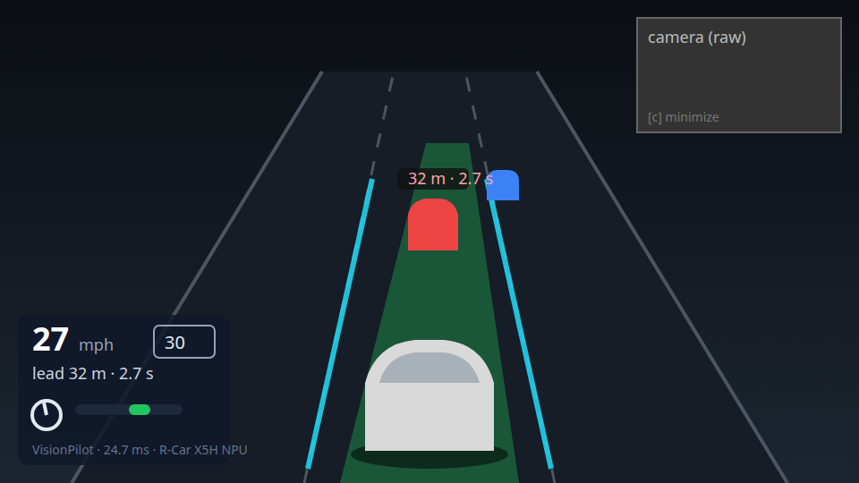
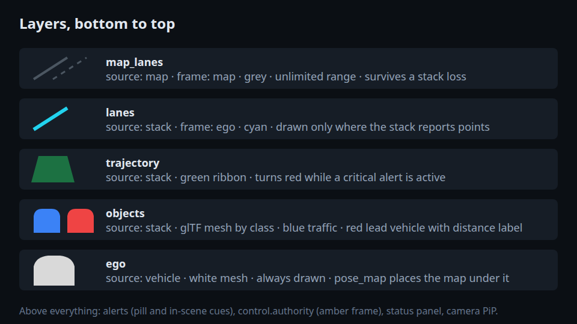
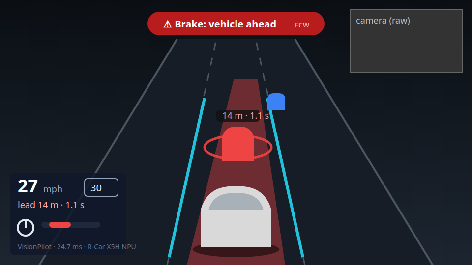
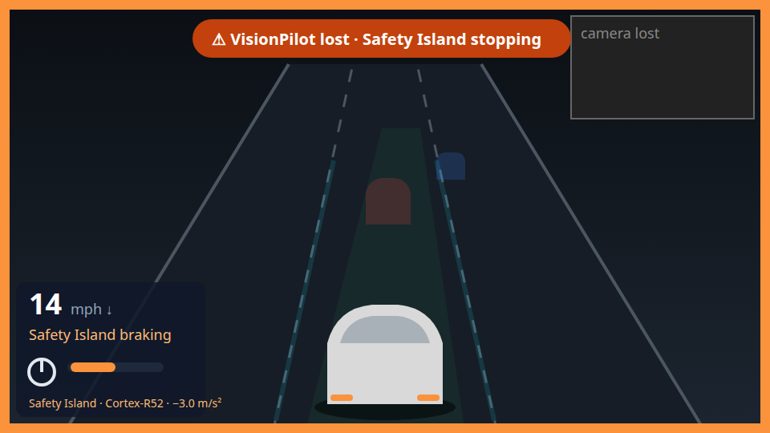
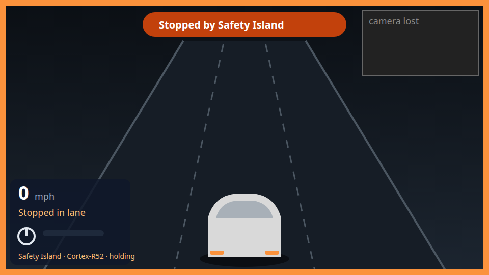

# ADAS dashboard: design

Date: 2026-09-21
Status: approved design, implementation starts 2026-09-28
Tracking issue: the repository issue named "Tracking: CES 2027 dashboard".

## 1. Goal

A browser page that shows what an automated driving stack sees, plans and does. A visitor with no technical background must understand it in a few seconds. The first use is the Autoware Foundation booth at CES 2027. There, the stack is VisionPilot on a Renesas R-Car X5H board and the world is a CARLA simulation. If VisionPilot fails, a Safety Island on the board's Cortex-R52 core stops the car.

The page is not tied to VisionPilot or CARLA. Its input is a small set of JSON messages over WebSocket. Any driving stack can feed it through a thin adapter, for example VisionPilot, Autoware or an end-to-end model. The same holds for any vehicle, real or simulated, and for any map source. The repository will move to the Autoware Foundation organization later, so everything in it follows Autoware conventions: Apache-2.0, English only, DCO sign-off on every commit, and no vendor name in the code.

The visitor must get one sentence from the screen. The stack drives the car. If the stack fails, the Safety Island stops it.

## 2. Roles and responsibilities

| Part                                                      | Where                                              | Who                                                          |
| --------------------------------------------------------- | -------------------------------------------------- | ------------------------------------------------------------ |
| Frontend (this repository)                                | `src/`, static build in `dist/`                    | MultiCoreWare                                                |
| Message schema, recordings, replay tool (this repository) | `schema/`, `recordings/`, `tools/`                 | Autoware Foundation side (Yutaka Kondo), ready before week 1 |
| VisionPilot adapter, `stack` role                         | `vision_pilot` repository, C++                     | Autoware Foundation side                                     |
| CARLA adapter, `vehicle` and `map` roles                  | this repository, `adapters/carla/`, Python         | Autoware Foundation side                                     |
| Safety Island adapter, `supervisor` role                  | this repository, `adapters/safety_island/`, Python | Autoware Foundation side                                     |

MultiCoreWare works only in this repository and only against the replay tool until the bench integration in week 5. Every frontend feature must run from a recording, with no hardware.

## 3. Decisions

These decisions were taken in the design session on 2026-09-21 with mockups. They are fixed unless a weekly review changes them.

1. Layout: theater. The 3D scene fills the page. The camera image is a small picture-in-picture window at the top right that the operator can minimize. Numbers and status sit in a small panel at the bottom left and never compete with the scene.
2. Alerts are drawn where the cause is. The lead vehicle gets a red ring, the trajectory turns red, the crossed lane line turns red. A short pill at the top center names the alert in plain words. There is no permanent alert bar.
3. Takeover keeps the scene alive. If the stack is lost, its layers fade to ghosts. If the supervisor takes control, the page frame turns amber and the pill explains. The ego vehicle keeps moving and slowing on real vehicle data until it stops. No modal card, no event timeline.
4. Camera: a low chase camera behind and above the ego vehicle, about 25 degrees down. Pitch and distance are configuration values. A second, higher preset exists for tuning on the booth monitor.
5. Style: dark matte. Flat, lightly shaded solids on a dark gradient, one key light, soft shadows. A light theme uses the same layout with different color tokens.
6. Layers: map lanes in grey to the horizon. Perceived lane lines in cyan, only where the stack reports them. The planned trajectory as a green ribbon. Objects as meshes. The ego vehicle as a white mesh.
7. Other vehicles come from the stack only. Ground truth positions from the simulator are not drawn.
8. All on-screen text is English.
9. The status panel shows: speed and speed limit, lead vehicle distance and time gap, steering and pedal, and one line with the stack name, latency and device.

## 4. Architecture

```text
stack adapter      ──ws──┐
vehicle adapter    ──ws──┤
map adapter        ──ws──┼──▶  browser page (this repository)
supervisor adapter ──ws──┘

replay tool (tools/replay.py) ──ws──▶ browser page   (development, no hardware)
```

Four roles feed the page. Each role is a WebSocket endpoint that sends JSON text frames. The page holds the latest message of each type and draws from that. The page never sends data back, except an optional `{"type":"ping"}`.

| Role         | Sends                                      | Example sources                                                    |
| ------------ | ------------------------------------------ | ------------------------------------------------------------------ |
| `stack`      | what the driving stack perceives and plans | VisionPilot, Autoware planning and perception, an end-to-end model |
| `vehicle`    | ego motion and pose                        | CARLA, a real vehicle CAN bridge, Autoware `kinematic_state`       |
| `map`        | static lane geometry                       | CARLA OpenDRIVE, Lanelet2, an HD map                               |
| `supervisor` | who controls the car and why               | Safety Island on the Cortex-R52, Autoware MRM, a driver takeover   |

One endpoint can carry more than one role. The `hello` message lists the roles that an endpoint carries. In the CES setup, the VisionPilot process on the board serves `stack`. One Python process on the CARLA host serves `vehicle`, `map` and `supervisor`.

The endpoints are given in the page URL, for example `index.html?stack=ws://192.168.0.20:8090/stack&world=ws://192.168.0.1:8091/world`. If the URL names no endpoint, the page reads `config.json` next to `index.html`. Endpoint names in the URL and in `config.json` are free. The page connects to all of them and learns the roles from `hello`.

## 5. Message schema

The schema is versioned. JSON Schema files live in `schema/v1/`. The page rejects an endpoint whose `hello.schema` is not `1` and shows the reason in the bottom left corner.

### 5.1 Conventions

- Every message is one JSON object in one WebSocket text frame.
- Every message has `source` (a short name for the sender), `type`, and `t_ms` (the sender's monotonic clock in milliseconds). Clocks of different senders are not aligned. The page does not try to align them.
- Units: meters, radians, meters per second, meters per second squared. Angles are counterclockwise positive.
- Frames: `ego` is x forward, y left, z up, origin at the center of the ego vehicle's rear axle on the ground. `map` is the map's own fixed frame. A message with geometry names its frame. If no `vehicle` message with `pose_map` exists, `map` frame geometry is not drawn.
- Fields marked `?` are optional. Unknown fields are ignored.

### 5.2 Messages

`hello`, sent once right after the connection opens:

```json
{
  "source": "visionpilot",
  "type": "hello",
  "t_ms": 0,
  "schema": 1,
  "roles": ["stack"],
  "name": "VisionPilot",
  "device": "R-Car X5H NPU"
}
```

`ego` (role `vehicle`, 10 to 50 Hz):

```json
{
  "source": "carla",
  "type": "ego",
  "t_ms": 812345.6,
  "speed_mps": 11.9,
  "steer_rad": -0.02,
  "accel_mps2": 0.4,
  "pose_map": { "x": 12.3, "y": -45.6, "yaw": 1.57 }
}
```

`objects` (role `stack`, every perception frame). `class` is a free string. The page has meshes for `car`, `suv`, `truck`, `bus`, `trailer`, `pedestrian`, `cyclist` and `bicycle`. Any other class is drawn as a box. `id` is stable across frames for the same object, so the page can interpolate motion and fade objects in and out. `lead` marks the closest object in the ego path. `predicted_paths?` is a list of point lists with a `confidence` each, reserved for stacks that predict motion. In schema 1 the page ignores it.

```json
{
  "source": "visionpilot",
  "type": "objects",
  "t_ms": 812345.6,
  "frame": "ego",
  "objects": [
    {
      "id": 7,
      "class": "car",
      "x": 32.1,
      "y": -0.3,
      "yaw": 0.0,
      "length": 4.5,
      "width": 1.9,
      "height": 1.5,
      "lead": true,
      "distance_m": 32.1
    },
    {
      "id": 9,
      "class": "truck",
      "x": 61.0,
      "y": 3.4,
      "yaw": 0.0,
      "length": 10.0,
      "width": 2.4,
      "height": 3.2,
      "lead": false,
      "predicted_paths": [
        {
          "confidence": 0.8,
          "pts": [
            [62.0, 3.4],
            [70.0, 3.5]
          ]
        }
      ]
    }
  ]
}
```

`lanes` (role `stack`): the lane boundaries the stack perceived, as point lists. Send only the points the stack actually has. The page draws nothing beyond the last point.

```json
{
  "source": "visionpilot",
  "type": "lanes",
  "t_ms": 812345.6,
  "frame": "ego",
  "lanes": [
    {
      "kind": "left",
      "pts": [
        [1.0, 1.7],
        [5.0, 1.7],
        [10.0, 1.68]
      ]
    },
    {
      "kind": "right",
      "pts": [
        [1.0, -1.7],
        [5.0, -1.7],
        [10.0, -1.72]
      ]
    }
  ]
}
```

`trajectory` (role `stack`): the planned path as points. A stack that plans a curve sends samples of it, for example every meter to 150 m. `behavior?` is a free string such as `lane_change_left` or `yield`, and `stop?` is a stop point with a `reason` string. Both are reserved for stacks that plan behaviors. In schema 1 the page ignores them.

```json
{
  "source": "visionpilot",
  "type": "trajectory",
  "t_ms": 812345.6,
  "frame": "ego",
  "width_m": 2.3,
  "pts": [
    [0.5, 0.0],
    [1.5, 0.0],
    [2.5, 0.01]
  ],
  "behavior": "keep_lane",
  "stop": { "x": 48.0, "y": 0.0, "reason": "traffic_light" }
}
```

`map` (role `map`, on connect and whenever the ego moved more than 20 m, `frame` is always `map`). `features` is a list of polylines with a `kind`. The page draws `lane_solid`, `lane_dashed` and `road_edge` in schema 1 and ignores other kinds. `crosswalk`, `stop_line` and `traffic_light` are the reserved kinds for maps with such features.

```json
{
  "source": "carla",
  "type": "map",
  "t_ms": 812345.6,
  "frame": "map",
  "range_m": 200,
  "features": [
    {
      "kind": "lane_dashed",
      "pts": [
        [10.0, -40.0],
        [20.0, -40.1]
      ]
    },
    {
      "kind": "stop_line",
      "pts": [
        [48.0, -42.0],
        [48.0, -38.0]
      ]
    }
  ]
}
```

`alerts` (role `stack` or `supervisor`). The list is the full set of active alerts. An empty list clears them. `severity` is `info`, `warn` or `critical`. `text` is what the page shows. `code` is a short machine name shown in small print. `target` tells the page what to color: `lead`, `trajectory`, `lane_left`, `lane_right`, or absent.

```json
{
  "source": "visionpilot",
  "type": "alerts",
  "t_ms": 812345.6,
  "alerts": [
    { "code": "FCW", "severity": "critical", "text": "Brake: vehicle ahead", "target": "lead" }
  ]
}
```

`control` (role `stack` or `supervisor`, 10 Hz or on change). `authority` is `stack`, `supervisor`, `driver` or `remote`. The page treats the newest `control` message from any endpoint as the truth. `driver` and `remote` get the same amber frame as `supervisor` in schema 1.

```json
{
  "source": "safety_island",
  "type": "control",
  "t_ms": 523.0,
  "authority": "supervisor",
  "steer_rad": 0.0,
  "accel_mps2": -3.0
}
```

`status` (any role, 1 Hz or on change). `mode` is `active`, `standby` or `lost`. `stages` is optional per-stage latency for the status line.

```json
{
  "source": "visionpilot",
  "type": "status",
  "t_ms": 812345.6,
  "name": "VisionPilot",
  "device": "R-Car X5H NPU",
  "mode": "active",
  "latency_ms": 24.7,
  "stages": { "pre": 1.8, "AutoDrive": 8.1, "AutoSteer": 7.2, "AutoSpeed": 6.9 },
  "speed_limit_mps": 13.4
}
```

### 5.3 Rates and reconnect

| Role         | Typical rate                 | Notes                                                     |
| ------------ | ---------------------------- | --------------------------------------------------------- |
| `stack`      | 10 to 40 Hz                  | one `objects`, `lanes`, `trajectory` per perception frame |
| `vehicle`    | 10 to 50 Hz                  |                                                           |
| `map`        | on connect, then on movement | a message is at most 1 MB                                 |
| `signals`    | reserved                     | traffic light states, not in schema 1                     |
| `supervisor` | 10 Hz                        | `control` and `status`                                    |

The page reconnects to a closed endpoint with a backoff from 0.5 s to 5 s and keeps trying forever. A closed `stack` endpoint is a meaningful event (section 6.3), not an error.

### 5.4 Growing the schema

The schema must serve stacks beyond the CES demo. That range goes from a camera-only L2 stack to an L4 stack with prediction, traffic lights and remote operation. The rules for growth are:

- A new optional field on an existing type, or a new `type`, does not change the schema version. The page ignores what it does not know.
- A renamed field, a removed field, a changed unit or a changed frame is a breaking change. It raises `hello.schema`, and the page keeps the old version for one release.
- Class names and feature kinds are strings with a recommended list, never a closed enumeration.
- Schema 1 reserves `predicted_paths`, `behavior`, `stop`, the map kinds `crosswalk`, `stop_line` and `traffic_light`, the `remote` authority, and the `signals` type. An L4 adapter can send them today. The page will draw them once the frontend supports them.

An Autoware stack maps onto the roles through the AD API, so the adapter does not depend on internal topics:

| Role         | Type               | AD API source                                                                                                           |
| ------------ | ------------------ | ----------------------------------------------------------------------------------------------------------------------- |
| `stack`      | `objects`          | `/api/perception/objects` (class, pose, size, predicted paths)                                                          |
| `stack`      | `trajectory`       | `/api/planning/...` trajectory and velocity factors (`stop.reason`)                                                     |
| `stack`      | `alerts`, `status` | `/api/fail_safe/mrm_state`, `/api/operation_mode/state`, diagnostics                                                    |
| `vehicle`    | `ego`              | `/api/vehicle/kinematics`, `/api/vehicle/status`                                                                        |
| `map`        | `map`              | Lanelet2 lane boundaries, crosswalks and stop lines around the ego                                                      |
| `supervisor` | `control`          | `/api/operation_mode/state`: `autonomous` is `stack`, `local` is `driver`, `remote` is `remote`, an MRM is `supervisor` |
| `signals`    | reserved           | `/api/perception/traffic_signals`                                                                                       |

This adapter is a future task in `adapters/autoware/`, not part of the CES 2027 milestones.

## 6. Screen design

### 6.1 Layout



The scene fills the page at any aspect ratio. The booth monitor is 1920 by 1080. The status panel (bottom left) is about 240 by 170 px at that size and scales with the viewport height. The camera picture-in-picture (top right) is about 230 by 130 px. The `c` key minimizes it to a 40 px pill. It is an `<iframe>` of the raw camera stream URL given in the configuration. The page draws nothing on top of the camera image.

### 6.2 Layers



Bottom to top: map lanes (grey, to the horizon). Perceived lanes (cyan, only where reported). Trajectory (green ribbon, `width_m` wide). Objects (glTF meshes, blue traffic, red lead vehicle with a distance label above it). Ego (white mesh with a soft ground shadow). The camera follows the ego heading with a short lerp so lane changes read as the car moving sideways.

Object motion is interpolated between messages by `id`. A new `id` fades in over 300 ms. An `id` that stops arriving fades out over 500 ms. Meshes are chosen by `class`. A `class` with no mesh uses a plain box of the given size.

### 6.3 States

Two independent signals decide the state: whether the `stack` endpoint is alive, and who has `control.authority`.

| State      | Condition                                                 | Appearance                                                                                                                                                                                                    |
| ---------- | --------------------------------------------------------- | ------------------------------------------------------------------------------------------------------------------------------------------------------------------------------------------------------------- |
| Connecting | no endpoint has sent `hello`                              | dark scene and the map. A small `Waiting for vehicle...` at the bottom left. Nothing large                                                                                                                    |
| Driving    | `stack` alive, `authority = stack`, no alert above `info` | section 6.1                                                                                                                                                                                                   |
| Alert      | `stack` alive, an alert with `warn` or `critical`         | see below                                                                                                                                                                                                     |
| Stack lost | `stack` endpoint closed, or `status.mode = lost`          | stack layers fade to 15 percent opacity over 500 ms, pill `<stack name> lost`, camera PiP shows `camera lost` on its last frame                                                                               |
| Takeover   | `authority = supervisor`                                  | Stack lost plus an amber page frame. The pill shows the supervisor's `alerts[].text`. The speed shows a down arrow. The pedal bar shows `control.accel_mps2`. The status line shows the supervisor's `status` |
| Stopped    | Takeover and `speed_mps < 0.1` for 1 s                    | pill `Stopped by <supervisor name>`, frame stays amber, held until a `stack` `status.mode = active` arrives, then a 1 s fade back to Driving                                                                  |



Alert: the `target` gets the red treatment (a red ring around the lead vehicle, a red trajectory, a red lane line). The pill at the top center shows `text` with `code` in small print. `critical` pulses the pill at 1 Hz. If the alert list becomes empty, the page holds the state for 500 ms and then clears it. A flickering alert therefore does not flicker on screen.





If the `vehicle` endpoint closes, the ego vehicle stops at its last pose. A small `vehicle link lost` appears at the bottom left. If the `map` endpoint is absent, the map layer is not drawn. The page never shows a dialog or a stack trace.

### 6.4 Status panel

Bottom left, in this order. Speed as a large number with the unit. The speed limit in a small rounded box. The lead vehicle distance and time gap (`distance_m / speed_mps`, omitted below 0.5 m/s). A steering wheel icon that rotates with `steer_rad`. A horizontal pedal bar: green right of center for acceleration, red left of center for braking, amber during Takeover. One small line `<name> · <latency_ms> ms · <device>`. `units` in the configuration selects `mph` or `km/h`.

### 6.5 Style

Dark matte by default. Background gradient `#0b0f14` to `#1c2530`. Road `#161d26`. Map lanes `#4b5661`. Perceived lanes `#22d3ee`. Trajectory `#22c55e`. Traffic `#3b82f6`. Lead vehicle `#ef4444`. Ego `#d9d9d9`. Alert `#b91c1c`. Takeover `#fb923c`. All colors are CSS custom properties so the light theme (`t` key) only redefines tokens. Meshes use a flat material with one directional key light and a soft contact shadow. No bloom, no post-processing.

Text in the scene uses a system sans-serif font. The pill text is at least 20 px at 1080p. The speed number is at least 40 px.

## 7. Operator controls and configuration

Keyboard only, no on-screen buttons:

| Key | Action                                      |
| --- | ------------------------------------------- |
| `c` | minimize or restore the camera PiP          |
| `t` | dark or light theme                         |
| `f` | fullscreen                                  |
| `1` | camera preset chase (default)               |
| `2` | camera preset high                          |
| `r` | reset state (clears Stopped, clears alerts) |

`config.json`:

```json
{
  "endpoints": { "stack": "ws://192.168.0.20:8090/stack", "world": "ws://192.168.0.1:8091/world" },
  "camera_url": "http://192.168.0.20:8080/",
  "units": "mph",
  "theme": "dark",
  "camera": {
    "chase": { "pitch_deg": 25, "distance_m": 18, "lookahead_m": 12 },
    "high": { "pitch_deg": 50, "distance_m": 60, "lookahead_m": 30 }
  }
}
```

URL query parameters override `config.json` key by key.

## 8. Frontend stack and repository layout

- Vite, TypeScript, three.js. No UI framework, no CSS framework. Node 22 LTS.
- `npm run build` produces `dist/`, a static folder that any HTTP server can serve. `npm run dev` serves it with hot reload. `python3 -m http.server -d dist` is enough on the booth.
- Tests with Vitest: the state machine (section 6.3) and the frame transforms (`map` to `ego`). One replay smoke test that loads a recording and makes sure that all six states are reached. No end-to-end browser tests are required.
- Lint and format with the repository's `pre-commit` configuration (ESLint, Prettier, cspell, markdownlint). CI runs build, tests and pre-commit on every pull request.

```text
adas-dashboard/
├── docs/            design.md, mockups/
├── schema/v1/       JSON Schema per message type
├── recordings/      JSONL recordings for development
├── tools/           replay.py, record.py (Python 3.12)
├── adapters/        carla/, safety_island/ (Python)
├── assets/meshes/   .glb meshes, LICENSE, convert script
├── src/             frontend
├── index.html       page entry (Vite root)
└── public/          config.json
```

## 9. Assets and licenses

The vehicle meshes come from `autoware_perception_rviz_plugin/meshes/` in `autowarefoundation/autoware_rviz_plugins`: `car`, `suv`, `truck`, `bus`, `trailer`, `pedestrian`, `cyclist`, `bicycle` as COLLADA `.dae`. They are by Sebastian Preuße under CC BY-SA 4.0. Convert them to `.glb` with a script kept in `assets/meshes/` (Blender in background mode or `assimp`). Keep the original `LICENSE` file next to the output. Credit the author in `README.md`, and show the credit on the page in the Connecting state and in the light theme footer. The `-brake` and `-indicator` variants are not used. The rviz plugin picks `car` or `suv` from the height to length ratio. If `class` is `car` and `height / length > 0.36`, the page draws the `suv` mesh.

Code is Apache-2.0. Recordings are CC0.

## 10. Development without hardware

Before week 1, the repository holds a generated recording of one full run of the CES scenario. `tools/synth.py` generates it, and the bench recording from W5 replaces it. One JSONL file per endpoint, one message per line, exactly as the endpoint sent it. `tools/replay.py` serves those files on local WebSocket ports with the original timing from `t_ms`, loops or stops at the end, and accepts `--speed`. `tools/record.py` records live endpoints into the same format.

Every frontend feature must be demonstrated on the replay before it is called done.

## 11. Performance

- 1920 by 1080 at 60 fps on an RTX 4070 Laptop GPU that also runs CARLA, and at 30 fps on integrated graphics.
- 50 objects, 20 map polylines of 200 points, 150 trajectory points, without a frame drop.
- No allocation per frame for objects: reuse mesh instances by `id`.
- Page load under 2 s from a LAN server, meshes included. Meshes total under 3 MB as `.glb`.
- Runs 8 hours without a memory increase.

## 12. Weekly milestones

Work runs from 2026-09-28 to 2026-10-30. Each week ends with something that runs. A 30 minute review on Friday fixes the plan for the next week. The tracking issue mirrors this table as a task list.

| Week     | Dates          | Deliverable                                                                                                                                                                                    | Owner         |
| -------- | -------------- | ---------------------------------------------------------------------------------------------------------------------------------------------------------------------------------------------- | ------------- |
| W0       | 09-22 to 09-26 | repository, JSON Schema v1, a generated recording of the kill route from tools/synth.py, replay.py. The bench recording replaces the generated one in W5                                       | AWF side      |
| W1       | 09-28 to 10-02 | frontend skeleton with Vite, TypeScript and three.js. Connects to the replay. Chase camera. Road plane, map lanes and a box ego move. `hello.schema` is compared                               | MultiCoreWare |
| W2       | 10-05 to 10-09 | meshes. `.glb` conversion, class to mesh, interpolation by `id`, fade in and out, dark matte material and shadow, CC BY-SA credit                                                              | MultiCoreWare |
| W3       | 10-12 to 10-16 | perception layers and status panel. Cyan lanes, green trajectory, lead distance label, speed and limit, gap, steering and pedal, latency line. Alert state                                     | MultiCoreWare |
| W4       | 10-19 to 10-23 | remaining states. Connecting, Stack lost, Takeover, Stopped. Amber frame, ghosting, camera PiP `<iframe>` and `c`, theme `t`, URL configuration. The whole recording plays through every state | MultiCoreWare |
| W2 to W4 | in parallel    | VisionPilot adapter in `vision_pilot`. CARLA and Safety Island adapters here                                                                                                                   | AWF side      |
| W5       | 10-26 to 10-30 | bench integration. Live VisionPilot on the board and live adapters on the CARLA host. Kill route end to end. 60 fps next to CARLA. Camera and color values tuned on the booth monitor          | both          |

## 13. Out of scope

- Any drawing on top of the camera image. The camera PiP is the raw stream.
- Ground truth objects from the simulator.
- An event timeline or replay controls on the booth page.
- Mouse orbit on the booth page.
- Pedestrian and cyclist detection from VisionPilot (it has no such output). The meshes are included for other stacks.
- Sound.
- Authentication on the WebSocket endpoints. The bench is a closed LAN.

## 14. Acceptance

If all of these hold, the work is complete:

1. `npm run build` and `npm test` pass in CI, and pre-commit is clean.
2. The recorded kill run replays through Connecting, Driving, Alert, Stack lost, Takeover and Stopped with the appearance in section 6, in both themes.
3. The live bench run in W5 shows the same with VisionPilot on the board and CARLA on the host. It runs at 60 fps at 1080p while CARLA renders on the same GPU.
4. Every endpoint's messages pass the JSON Schema in `schema/v1/`.
5. The page runs from `python3 -m http.server -d dist` with `config.json` only.
6. Every commit is signed off (DCO) and the repository contains no text in a language other than English.

## 15. Appendix: the CES 2027 adapters

For reference, not for MultiCoreWare to build.

VisionPilot (`stack`): a WebSocket server in the VisionPilot process, next to the existing WebRTC stream in `modules/visualization/`, reusing Boost.Beast and nlohmann/json that are already linked. The existing `occupancy_bridge.cpp` conversion (pixels to ego frame through the homography, lane samples, path coefficients, CIPO) becomes the JSON producer. The trajectory is the path polynomial sampled every meter to 150 m. `class` is `car`, `suv` or `truck` from the same width heuristic the Occupancy view uses today. `alerts` come from `Plan::warnings` (`FCW`, `AEB`, `LLDW`, `RLDW`). `status.stages` come from the per-frame latency fields. A configuration flag makes the WebRTC stream send the raw resized camera image instead of the HUD image. The PiP then shows the camera and nothing else.

CARLA (`vehicle`, `map`): a Python client on the CARLA host. It reads the ego actor's transform and velocity and the OpenDRIVE map. It sends `ego` at 20 Hz and `map` with the lane boundaries around the ego.

Safety Island (`supervisor`): a ROS 2 node on the CARLA host on DDS domain 2. It watches the CR52's `control_cmd` and the bridge's source switch. It sends `control`, `status` and `alerts`. The `hello.name` is `Safety Island`, `device` is `Cortex-R52`.
